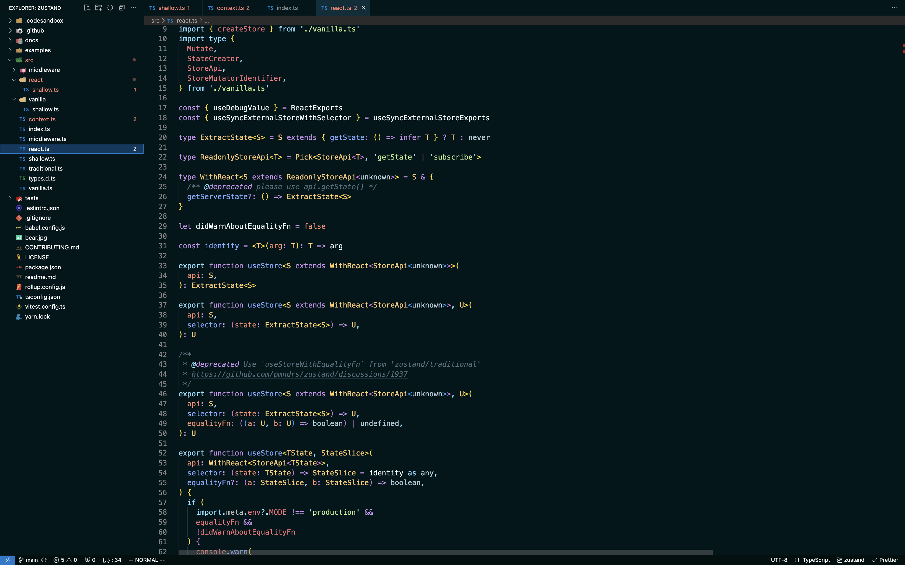

# Everything-zen: A Minimal, Dark Blue Theme for VS Code

## Overview

Everything-zen is a minimalistic dark blue theme for Visual Studio Code. It aims to provide a calm and focused coding environment with a touch of elegance. If you appreciate simplicity and a soothing color palette, this theme is designed just for you.

## Features

- **Minimalistic Design:** Keep your coding environment clutter-free.
- **Dark Blue Palette:** Enjoy a dark theme with a calming blue color scheme.
- **Easy on the Eyes:** Designed for long coding sessions without causing eye strain.

## Installation

1. Open Visual Studio Code.
2. Go to Extensions.
3. Search for "Everything-zen".
4. Click Install to apply the theme.

## Usage

1. After installation, go to Code > Preferences > Color Theme.
2. Select "Everything-zen" from the list.

## Screenshots

## Contributing

If you find any issues or have suggestions for improvements, feel free to contribute. Fork the repository, make your changes, and submit a pull request.

## Credits

- Theme created by `<YourUsername>`
- Inspired by the simplicity of Zen philosophy.

## License

This theme is licensed under the [MIT License](LICENSE).

---
